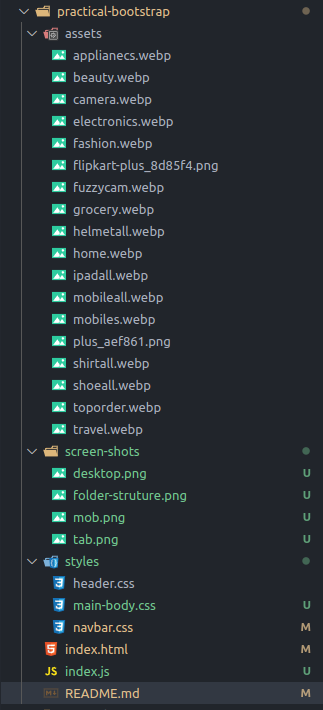
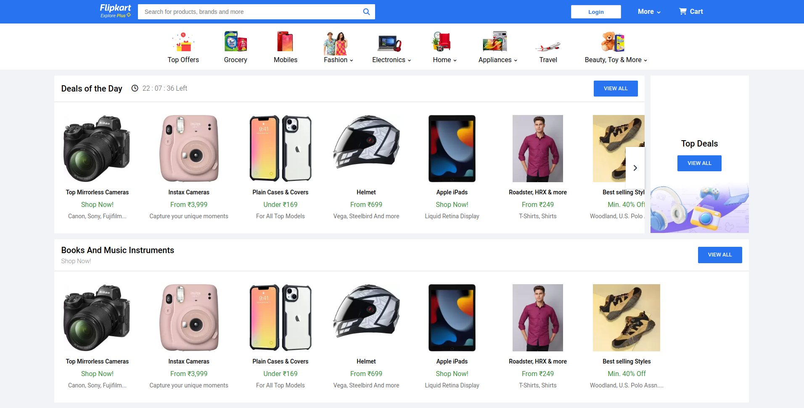

# HTML-Practical-Bootstrap

# ReadMe: HTML-Practical

Welcome to the ReadMe of the HTML-Practical repository! This document serves as a comprehensive guide to the repository and contains all the necessary information to get started with the practical exercise.

## Overview

- The HTML-Practical repository contains Flipkart home page view code which practical is given in the LMS portal. It is designed using HTML and CSS. This repository contains assets, styles, and some other files like index.html and index.js.
- HTML syntax contains various tags like section, article, and more. The style folder contains various CSS files like navbar.css , header.css, and main-container.css.
- index.js file consists Carousel code of product cards on the home page.
- Most of CSS part done using Bootstrap : Bootstrap is a free and open-source CSS framework directed at responsive, mobile-first front-end web development. It contains HTML, CSS and JavaScript-based design templates for typography, forms, buttons, navigation, and other interface components.
- To Add Bootstrap : Copy-paste the stylesheet <link> into your <head> before all other stylesheets to load our CSS.
```jsx
<link href="https://cdn.jsdelivr.net/npm/bootstrap@5.0.2/dist/css/bootstrap.min.css" rel="stylesheet" integrity="sha384-EVSTQN3/azprG1Anm3QDgpJLIm9Nao0Yz1ztcQTwFspd3yD65VohhpuuCOmLASjC" crossorigin="anonymous">
```
- For more information visit https://getbootstrap.com/docs/5.0/getting-started/introduction/

**Folder Structure:**



**Desktop View:**



**Tablet View:**


**Mobile View:**


## How to Use

To use the HTML-Practical repository, simply clone or download the repository to your local machine. Once downloaded, navigate to the repository folder and open the index.html file in your preferred web browser.

## Contributing

Contributions to the HTML-Practical repository are welcome.

We hope you find the HTML-Practical repository useful and enjoyable! If you have any questions or feedback, please don't hesitate to reach out to me. Happy learning!